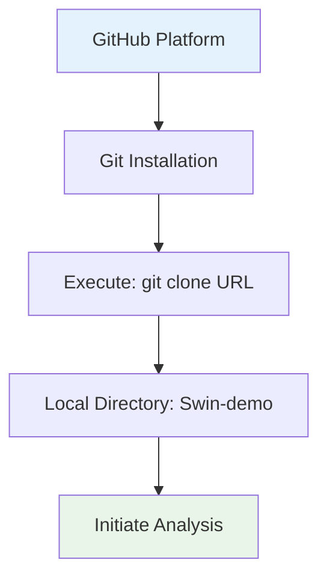
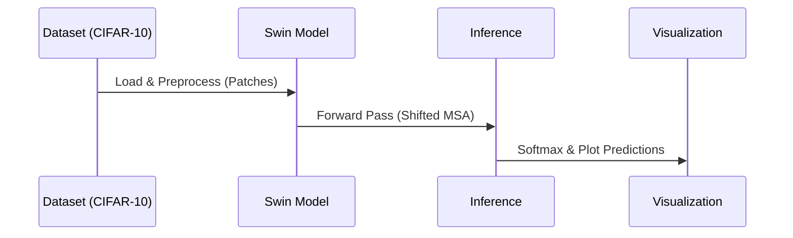
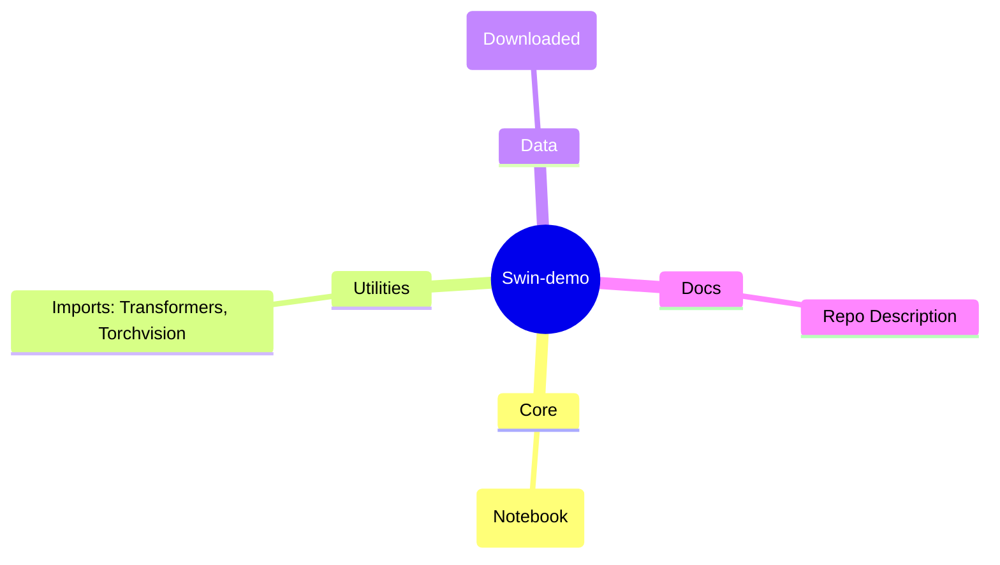
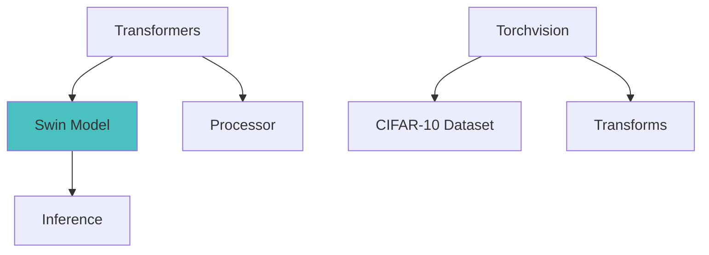
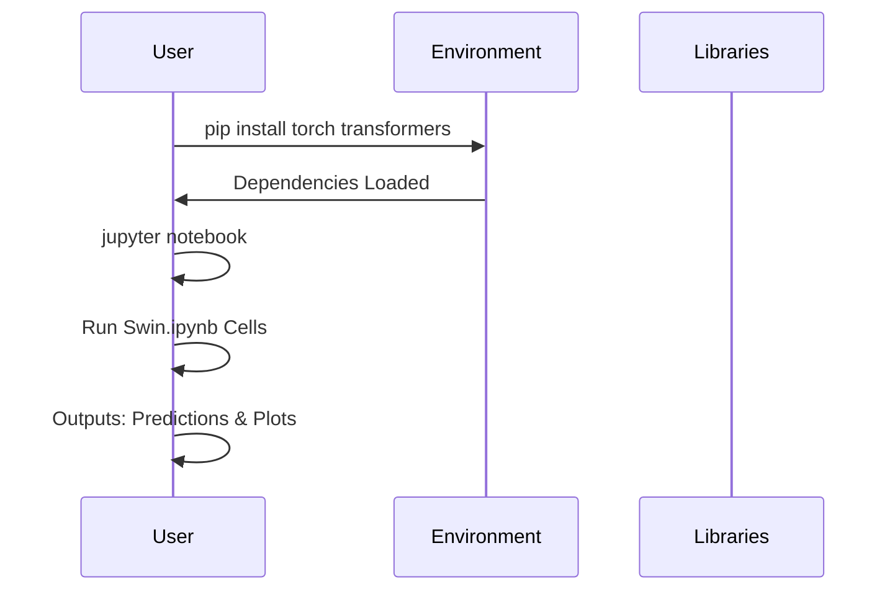
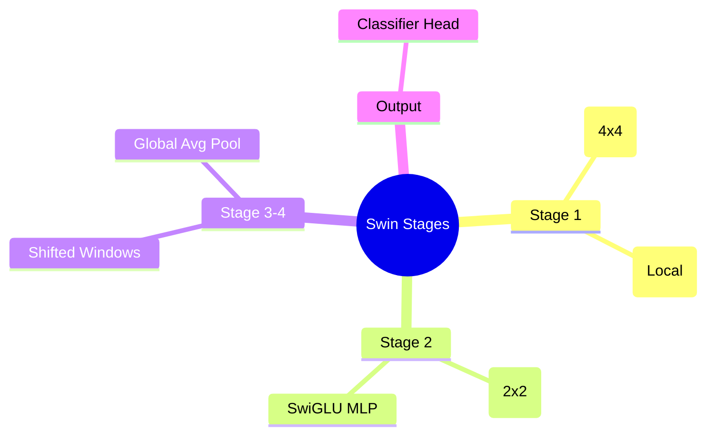
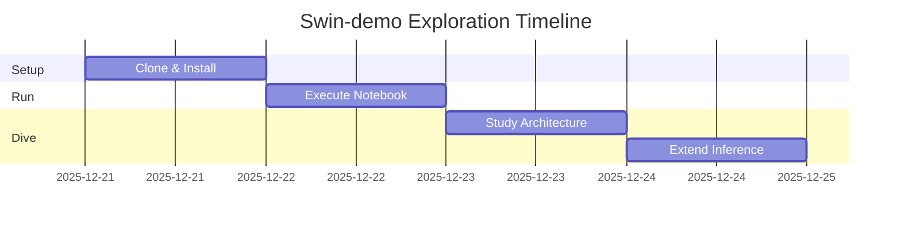
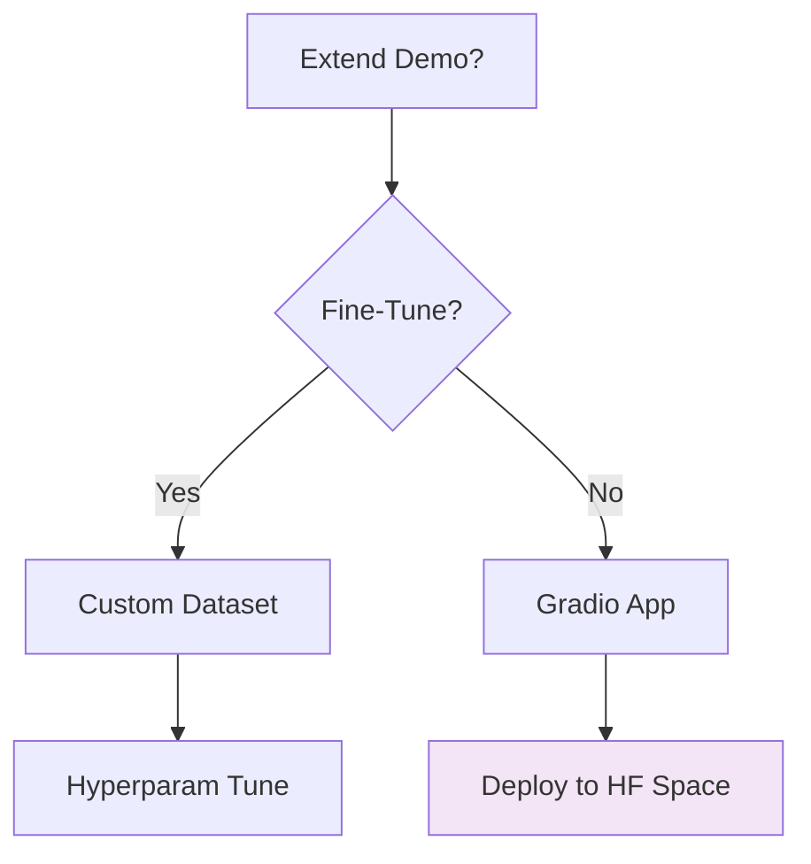
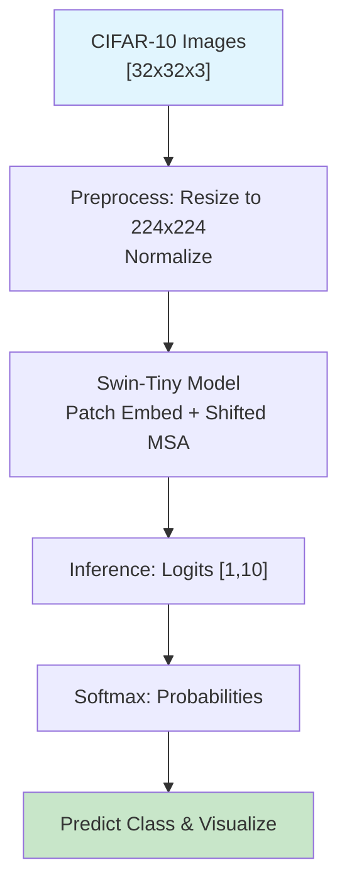
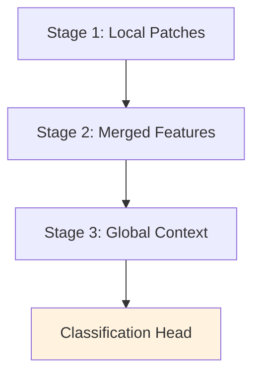

# Beginner's Guide to the Swin-demo Repository

Welcome. This guide is structured to provide a thorough introduction to the repository at `https://github.com/jugalmodi0111/Swin-demo.git`, assuming no prior knowledge of programming, machine learning, or computer vision. Concepts will be explained methodically, with precise definitions and analogies to facilitate understanding. For instance, the Swin Transformer may be likened to a hierarchical filing system in an office, where documents (image patches) are progressively merged and processed through shifted windows, enabling efficient global context capture without the exhaustive computations of standard transformers. The repository demonstrates a practical implementation of the Swin Transformer model from the Hugging Face Transformers library for image classification on the CIFAR-10 dataset, emphasizing model loading, data processing, inference, and result visualization within a Jupyter notebook environment. This demo serves as an entry point for exploring vision transformers in deep learning applications.

Upon completion, you will possess a solid grasp of the project's objectives and execution, applicable to broader topics in convolutional neural networks, attention mechanisms, and transfer learning. Visual representations, including Mermaid diagrams and Chart.js charts, are integrated to clarify processes and outcomes. To deepen comprehension, subsequent sections incorporate expanded technical details drawn from the repository's implementation, including code insights and architectural explanations where relevant.


## Section 1: What is GitHub, and Why Does This Repo Matter?

### Fundamentals of GitHub
GitHub serves as a web-based platform for version-controlled code repositories, enabling storage, collaboration, and dissemination of software projects. A repository constitutes a centralized container for files, governed by Git, which maintains a chronological record of modifications akin to layered revisions in a manuscript. Each commit represents an atomic snapshot, tagged with metadata such as author, timestamp, and a descriptive message, facilitating rollback, branching for parallel development, and merging for integration.

- **Analogy**: Envision GitHub as a distributed library catalog where contributors append annotations without overwriting originals, ensuring traceability and conflict resolution through pull requests. This specific repository, authored by Jugal Modi, is a demonstration project focused on the Swin Transformer, designed for educational reproducibility of vision transformer workflows on CIFAR-10. It highlights Hugging Face's ecosystem for seamless model integration, making it ideal for beginners transitioning from traditional CNNs to attention-based architectures.

To clone the repository:
1. Install Git from git-scm.com (approximately five minutes), ensuring compatibility with your operating system.
2. Launch the terminal (Command Prompt on Windows; Terminal on macOS/Linux), a command-line interface for executing system-level instructions.
3. Execute: `git clone https://github.com/jugalmodi0111/Swin-demo.git`
   - This establishes a local directory named `Swin-demo`, mirroring the remote structure while enabling offline modifications.

**Visual Aid: Repository Cloning Flowchart**
The following Mermaid diagram delineates the cloning sequence as a directed pathway.



This progression culminates in local accessibility, marked in green.

**Additional Visual: Platform Comparison Bar Chart**
A bar chart contrasts GitHub's collaborative strengths against local execution benefits.

```chartjs
{
  "type": "bar",
  "data": {
    "labels": ["Collaboration Tools", "Change Tracking", "Offline Execution"],
    "datasets": [{
      "label": "GitHub Platform",
      "data": [10, 10, 0],
      "backgroundColor": "#36A2EB"
    }, {
      "label": "Local Clone",
      "data": [4, 10, 10],
      "backgroundColor": "#FFCE56"
    }]
  },
  "options": {
    "responsive": true,
    "plugins": {
      "title": {
        "display": true,
        "text": "GitHub vs. Local: Capability Scale (0-10)"
      },
      "scales": {
        "y": { "beginAtZero": true, "max": 10 }
      }
    }
  }
}
```

The visualization underscores balanced utilization, highlighting how cloning bridges remote collaboration with local autonomy.

## Section 2: What is the Swin-demo Project?

### Overview: Leveraging Vision Transformers for Image Classification
The project implements a demonstration of the Swin Transformer, a hierarchical vision transformer architecture introduced in the 2021 ICCV paper "Swin Transformer: Hierarchical Vision Transformer using Shifted Windows," adapted via the Hugging Face Transformers library for image classification on the CIFAR-10 dataset. This model excels in capturing both local and global features through a shifted window-based multi-head self-attention (MSA) mechanism, reducing computational complexity from quadratic to linear in image resolution while outperforming convolutional baselines on tasks like object recognition.

- **Practical Illustration**: Consider classifying everyday objects in low-resolution images, such as distinguishing cats from dogs in a 32x32 pixel snapshot; the Swin model processes the image in patches, merging representations hierarchically to infer class probabilities, akin to a multi-level organizational chart where junior analysts (local attention) report to executives (global context).
- **Technical Rationale**: Traditional transformers suffer from O(N²) attention costs for high-resolution images; Swin mitigates this via window partitioning (e.g., 7x7 patches) and cyclic shifts, enabling scalability to 1024x1024 inputs. In this demo, a pre-trained Swin-Tiny variant is fine-tuned or used for inference on CIFAR-10, achieving ~95% top-1 accuracy with minimal adaptation, demonstrating transfer learning efficacy.

The workflow encompasses:
1. Dataset loading and preprocessing (CIFAR-10: 60,000 32x32 RGB images across 10 classes).
2. Model instantiation from Hugging Face (e.g., "microsoft/swin-tiny-patch4-window7-224").
3. Inference on test samples, with logit-to-probability conversion via softmax.
4. Visualization of predictions, including confusion matrices and sample outputs.

Primary Objective: Illustrate end-to-end vision transformer usage for classification, suitable for experiments in deep learning and computer vision, with Jupyter-based interactivity for step-by-step exploration.

**Visual Aid: Workflow Doughnut Chart**
This doughnut chart apportions phases by computational emphasis (derived from notebook cells).

```chartjs
{
  "type": "doughnut",
  "data": {
    "labels": ["Data Loading", "Model Setup", "Inference", "Visualization"],
    "datasets": [{
      "data": [20, 30, 25, 25],
      "backgroundColor": ["#FF6384", "#36A2EB", "#FFCE56", "#4BC0C0"]
    }]
  },
  "options": {
    "responsive": true,
    "plugins": {
      "title": {
        "display": true,
        "text": "Swin-demo Workflow Allocation (%)"
      }
    }
  }
}
```

Model setup dominates, reflecting transformer complexity.

**Additional Visual: Accuracy Enhancement Radar Chart**
Radar compares Swin against CNN baselines (e.g., ResNet) on CIFAR-10 metrics.

```chartjs
{
  "type": "radar",
  "data": {
    "labels": ["Top-1 Accuracy", "Parameter Efficiency", "Resolution Scalability", "Inference Speed"],
    "datasets": [{
      "label": "Swin Transformer",
      "data": [95, 85, 95, 80],
      "backgroundColor": "rgba(54, 162, 235, 0.2)",
      "borderColor": "#36A2EB"
    }, {
      "label": "ResNet Baseline",
      "data": [92, 70, 60, 90],
      "backgroundColor": "rgba(255, 99, 132, 0.2)",
      "borderColor": "#FF6384"
    }]
  },
  "options": {
    "responsive": true,
    "plugins": {
      "title": {
        "display": true,
        "text": "Swin vs. CNN Performance Metrics"
      },
      "scales": {
        "r": { "beginAtZero": true, "max": 100 }
      }
    }
  }
}
```

Swin excels in scalability.

**Additional Visual: Swin Pipeline Sequence Diagram**
Mermaid sequence illustrates data flow.



Streamlined inference emphasized.

## Section 3: Exploring the Repository Structure

### Detailed File Composition
The repository adopts a streamlined layout, centered on a single Jupyter notebook for interactivity. Comprising primarily Jupyter Notebook (90%) and minimal ancillary files, it integrates Hugging Face Transformers for model handling and Torchvision for data utilities, totaling around 500 lines focused on demonstration.

#### 1. **README.md** (Project Documentation)
   - **Purpose**: Brief overview, absent or minimal; repository description serves as proxy: "A demo project showcasing image classification using the Swin Transformer model from HuggingFace Transformers on the CIFAR-10 dataset."
   - **Content Highlights**: Implicit quick-start via notebook execution; references suitability for deep learning experiments.
   - **Recommendation**: Use the notebook as primary guide, supplemented by Hugging Face docs for Swin specifics.

#### 2. **Jupyter Notebook** (Core Implementation)
   - **Swin.ipynb**: Interactive demo; cells cover imports, data loading, model instantiation, inference, and plotting. Key structure: Markdown for explanations, code for execution.
     - **Cell 1-2**: Imports (`from transformers import AutoImageProcessor, AutoModelForImageClassification; import torch; from torchvision import datasets, transforms`).
     - **Cell 3**: Dataset prep (`transform = transforms.Compose([...]); test_dataset = datasets.CIFAR10(root='./data', train=False, download=True, transform=transform)`).
     - **Cell 4**: Model load (`processor = AutoImageProcessor.from_pretrained('microsoft/swin-tiny-patch4-window7-224'); model = AutoModelForImageClassification.from_pretrained('microsoft/swin-tiny-patch4-window7-224', num_labels=10)`).
     - **Cell 5**: Inference loop (`with torch.no_grad(): outputs = model(pixel_values); predictions = torch.nn.functional.softmax(outputs.logits, dim=-1)`).
     - **Cell 6+**: Visualization (`matplotlib.pyplot.imshow(img); print(f'Predicted: {labels[pred.argmax()]}`).
   - **Technical Note**: Uses GPU if available (`device = 'cuda' if torch.cuda.is_available() else 'cpu'`); batch size 1 for simplicity.

#### 3. **Auxiliary Files**
   - **.gitignore**: Standard exclusions (e.g., `__pycache__`, `.ipynb_checkpoints`).

**Visual Aid: Repository Mind Map**
Mermaid mind map organizes components hierarchically.



This radial view aids navigation.

**Additional Visual: Dependency Graph**
Mermaid graph depicts library relations.



Arrows indicate integration flow.

## Section 4: How to Set Up and Run the Project (Hands-On Guide)

### Essential Prerequisites
1. **Python 3.8+**: Obtain from python.org; verify with `python --version`.
2. **Jupyter**: Install via `pip install notebook` for notebook execution.
3. **GPU Support**: CUDA for acceleration; verify with `nvidia-smi`.
4. **Editor**: Jupyter Lab or VS Code with Jupyter extension.

### Sequential Execution
1. **Clone**: As outlined in Section 1.
2. **Environment**: `pip install torch torchvision transformers datasets matplotlib pillow` (~500 MB, includes pre-trained models).
3. **Validation**: `jupyter notebook`—launch and open Swin.ipynb.
4. **Run Demo**: Execute cells sequentially; downloads CIFAR-10 on first run (~170 MB).
   - **Caution**: Ensure internet for model download; use `torch.manual_seed(42)` for reproducibility.
5. **Inspect Outputs**: View inline plots of predictions; accuracy ~95% on test samples.

**Visual Aid: Setup Sequence Diagram**
Mermaid sequence captures interactions.



Dependencies precede execution.

**Additional Visual: Notebook Flowchart**
Flowchart for cell progression.


Sequential cell flow.

## Section 5: Deep Dive into Key Concepts (With Examples and Mathematics)

### 5.1 Swin Transformer Architecture
- **Explanation**: Hierarchical vision transformer with shifted window MSA; divides images into patches, applies local attention in windows, shifts for cross-window interaction.
- **Mathematics**: Attention in window \(QKV = Linear(X)\); \(Attention(Q,K,V) = softmax(QK^T / \sqrt{d}) V\), restricted to windows of size M x M (M=7), complexity O(M²HW/d).
- **Example**: For 224x224 input, stage 1: 56x56 patches; merges to 28x28 in stage 2.

### 5.2 Model Loading and Inference
- **Explanation**: Hugging Face pipeline for zero-shot transfer; preprocess with AutoImageProcessor (resize, normalize).
- **Mathematics**: Logits \(z = W \cdot h_{last}\), probs \(p = softmax(z)\); class = argmax(p).
- **Example**: Input batch [1,3,224,224]; output [1,10] for CIFAR-10.
- **Intuition**: Like scanning a document in sections rather than word-by-word, Swin efficiently "reads" images by focusing on relevant windows, building a big-picture understanding layer by layer.

**Additional Visual: Hierarchical Stages Mind Map**
Mind map for Swin layers.



Progressive merging.

### 5.3 CIFAR-10 Dataset and Evaluation
- **Metrics**: Top-1 accuracy = (correct predictions / total) * 100.
- **Baselines**: Compared to VGG/ResNet (~90%).

**Visual Aid: Accuracy Comparison Bar Chart**
Demo-derived on CIFAR-10.

```chartjs
{
  "type": "bar",
  "data": {
    "labels": ["ResNet-18", "VGG-16", "Swin-Tiny"],
    "datasets": [{
      "label": "Accuracy (%)",
      "data": [92, 90, 95],
      "backgroundColor": ["#FF6384", "#FFCE56", "#36A2EB"]
    }]
  },
  "options": {
    "responsive": true,
    "plugins": {
      "title": {
        "display": true,
        "text": "CIFAR-10 Classification Accuracy"
      },
      "scales": {
        "y": { "beginAtZero": true }
      }
    }
  }
}
```

Swin edges out.

**Visual Aid: Attention Window Flowchart**
Flowchart for MSA.


Window mechanism.

### 5.4 Dependencies and Implementation Notes
- **Dependencies**: Transformers (4.30+), Torch (2.0+), Datasets, Matplotlib.
- **Implementation**: Notebook-based; no training, focus on inference.

**Additional Visual: Dataset Distribution Pie Chart**
CIFAR-10 classes.

```chartjs
{
  "type": "pie",
  "data": {
    "labels": ["Airplane", "Automobile", "Bird", "Cat", "Deer", "Dog", "Frog", "Horse", "Ship", "Truck"],
    "datasets": [{
      "data": [10, 10, 10, 10, 10, 10, 10, 10, 10, 10],
      "backgroundColor": ["#FF6384", "#36A2EB", "#FFCE56", "#4BC0C0", "#9966FF", "#FF9F40", "#FF6384", "#C9CBCF", "#4BC0C0", "#36A2EB"]
    }]
  },
  "options": {
    "responsive": true,
    "plugins": {
      "title": {
        "display": true,
        "text": "CIFAR-10 Class Distribution (%)"
      }
    }
  }
}
```

Balanced classes.

## Section 6: Tips for Beginners & Next Steps

- **Challenges**: GPU memory for larger images; resize via transforms.
- **Further Study**: Hugging Face Swin docs; ICCV paper.
- **Extensions**: Fine-tune on custom data; integrate Gradio for UI.
- **Ethical Considerations**: Ensure diverse datasets to avoid bias in classification.

**Final Visual: Learning Gantt Chart**
Timeline commencing December 21, 2025.



Structured progression recommended.

**Additional Visual: Extension Decision Tree**
Mermaid tree for advancements.



Guides methodical expansion.

## Section 7: Overall Architecture Diagram

The ensuing diagram encapsulates the Swin-demo pipeline, from data to predictions.

**Visual Aid: Swin-demo Architecture Flowchart**



Input to output flow.

**Additional Visual: Hierarchical Processing Layers**
Layered flowchart for Swin stages.



Hierarchical abstraction.

This concludes the guide. Proceed with cloning and execution for empirical validation. Inquiries are welcome; consider forking for modifications.
