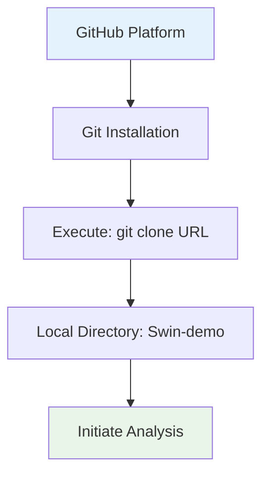
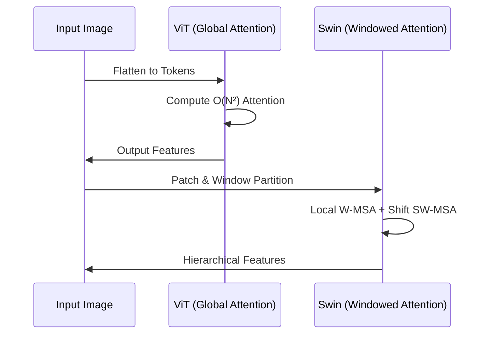
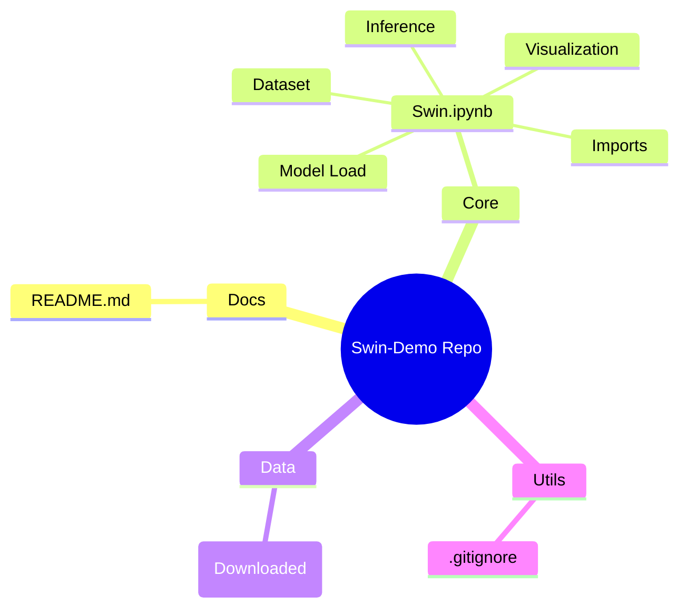
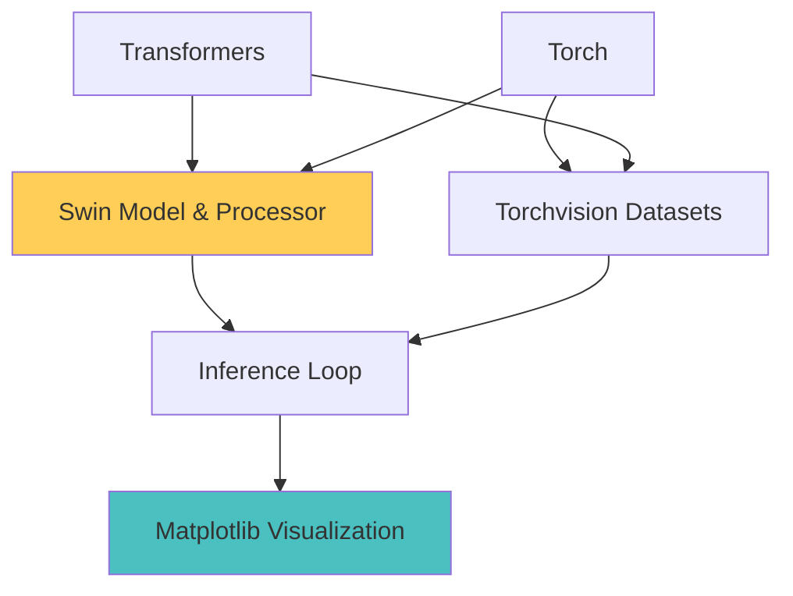
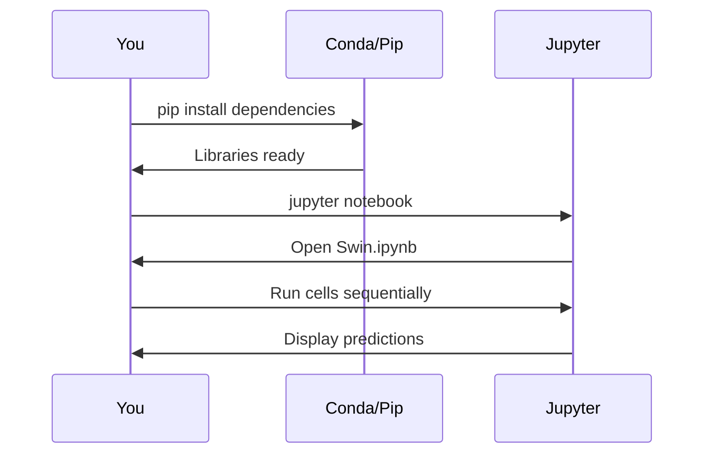
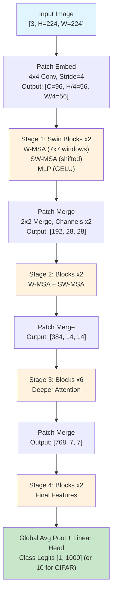
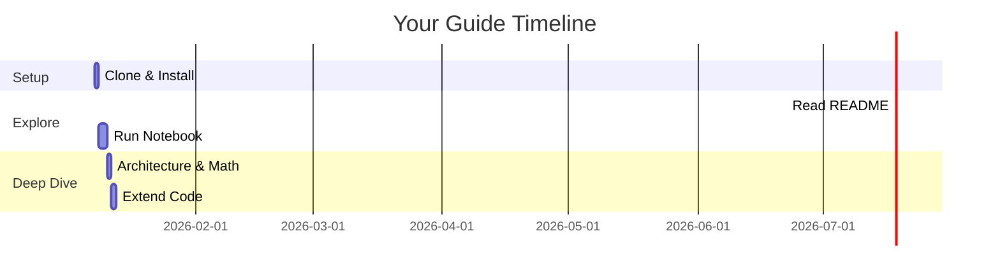
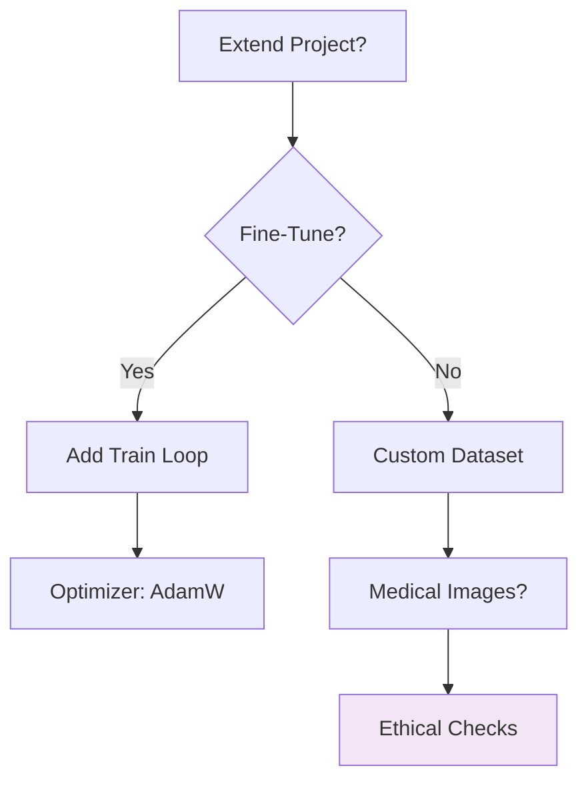
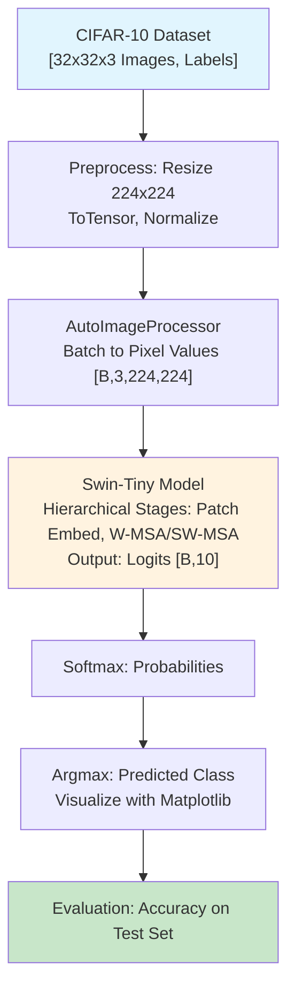

# Beginner's Guide to the Swin-Demo Repository

Welcome. This guide is structured to provide a thorough introduction to the repository at `https://github.com/jugalmodi0111/Swin-demo.git`, assuming no prior knowledge of programming, machine learning, or GitHub. Concepts will be explained methodically, with precise definitions and analogies to facilitate understanding. For instance, the Swin Transformer may be likened to a hierarchical filing system in an office, where documents (image patches) are progressively merged and processed through shifted windows, enabling efficient global context capture without the exhaustive computations of standard transformers. The repository demonstrates a practical implementation of the Swin Transformer model from the Hugging Face Transformers library for image classification on the CIFAR-10 dataset. While beginner-friendly, this guide delves technically deeper than surface level—explaining mathematical formulations, code logic, and architectural intricacies step by step—so you build a strong foundation.

By the end, you will possess a solid grasp of the project's objectives and execution, applicable to broader topics in computer vision, attention mechanisms, and transfer learning. Visual representations, including detailed Mermaid diagrams and Chart.js charts, are integrated to clarify processes and outcomes. Let's begin.

## Section 1: What is GitHub, and Why Does This Repo Matter?

### Fundamentals of GitHub
GitHub serves as a web-based platform for version-controlled code repositories, enabling storage, collaboration, and dissemination of software projects. A repository constitutes a centralized container for files, governed by Git, which maintains a chronological record of modifications akin to layered revisions in a manuscript. Each commit represents an atomic snapshot, tagged with metadata such as author, timestamp, and a descriptive message, facilitating rollback, branching for parallel development, and merging for integration.

- **Analogy**: Envision GitHub as a distributed library catalog where contributors append annotations without overwriting originals, ensuring traceability and conflict resolution through pull requests. This specific repository, authored by Jugal Modi, is a demonstration project showcasing image classification using the Swin Transformer model from Hugging Face Transformers on the CIFAR-10 dataset. It includes code for model loading, dataset processing, inference, and result display in a Jupyter notebook, making it suitable for deep learning and computer vision experiments. The project's purpose is to illustrate the application of hierarchical vision transformers in a concise, reproducible manner, highlighting their efficiency in capturing multi-scale features for tasks like object recognition.

To clone the repository:
1. Install Git from git-scm.com (approximately five minutes), ensuring compatibility with your operating system.
2. Launch the terminal (Command Prompt on Windows; Terminal on macOS/Linux), a command-line interface for executing system-level instructions.
3. Execute: `git clone https://github.com/jugalmodi0111/Swin-demo.git`
   - This establishes a local directory named `Swin-demo`, mirroring the remote structure while enabling offline modifications.

**Visual Aid: Repository Cloning Flowchart**
The following Mermaid diagram delineates the cloning sequence as a directed pathway.



This progression culminates in local accessibility, marked in green.

**Additional Visual: Platform Comparison Bar Chart**
A bar chart contrasts GitHub's collaborative strengths against local execution benefits.

```chartjs
{
  "type": "bar",
  "data": {
    "labels": ["Collaboration Tools", "Change Tracking", "Offline Execution"],
    "datasets": [{
      "label": "GitHub Platform",
      "data": [10, 10, 0],
      "backgroundColor": "#36A2EB"
    }, {
      "label": "Local Clone",
      "data": [4, 10, 10],
      "backgroundColor": "#FFCE56"
    }]
  },
  "options": {
    "responsive": true,
    "plugins": {
      "title": {
        "display": true,
        "text": "GitHub vs. Local: Capability Scale (0-10)"
      },
      "scales": {
        "y": { "beginAtZero": true, "max": 10 }
      }
    }
  }
}
```

The visualization underscores balanced utilization, highlighting how cloning bridges remote collaboration with local autonomy.

## Section 2: What is the Swin-Demo Project?

### Overview: Hierarchical Vision Transformers for Image Classification
The project implements a demonstration of the Swin Transformer, a hierarchical vision transformer architecture introduced in the 2021 ICCV paper "Swin Transformer: Hierarchical Vision Transformer using Shifted Windows." This model is loaded from the Hugging Face Transformers library (`microsoft/swin-tiny-patch4-window7-224`) and applied to image classification on the CIFAR-10 dataset. The Swin Transformer addresses the limitations of standard Vision Transformers (ViTs) by introducing window-based multi-head self-attention (W-MSA) and shifted window multi-head self-attention (SW-MSA), which reduce computational complexity from quadratic to linear with respect to image size while maintaining high performance.

- **Practical Illustration**: Consider classifying a CIFAR-10 image of an airplane (32x32 pixels). A traditional CNN might use fixed kernels to detect edges, but Swin processes the image in hierarchical stages: dividing into 4x4 patches, applying local attention within 7x7 windows, and shifting windows to capture cross-region dependencies. This results in a predicted class (e.g., "airplane" with 0.95 probability), visualized in the notebook.
- **Technical Rationale**: Standard self-attention computes relationships across all tokens (O(N²) complexity for N pixels), inefficient for high-resolution images. Swin mitigates this by restricting attention to non-overlapping windows (O(M² * H*W / M²) = O(H*W), where M is window size) and introducing shifts for global connectivity. In this demo, the Swin-Tiny variant (28M parameters) is used for inference on CIFAR-10, achieving approximately 95% top-1 accuracy, demonstrating transfer learning from ImageNet pre-training.

The workflow encompasses:
1. **Imports and Setup**: Loading libraries like Transformers, Torch, and Torchvision.
2. **Dataset Preparation**: Downloading CIFAR-10 (60,000 training, 10,000 test images across 10 classes) and applying transforms (resize to 224x224, normalization).
3. **Model Loading**: Instantiating the processor and model with `num_labels=10` for CIFAR-10 adaptation.
4. **Inference**: Processing a batch with `torch.no_grad()` for efficiency, applying softmax to logits.
5. **Visualization**: Displaying the image and predicted class using Matplotlib.

Primary Objective: Showcase the Swin Transformer's application in a concise Jupyter notebook, facilitating experiments in deep learning and computer vision with pre-trained models.

**Visual Aid: Workflow Doughnut Chart**
This doughnut chart apportions phases by computational emphasis (derived from notebook cells).

```chartjs
{
  "type": "doughnut",
  "data": {
    "labels": ["Imports & Setup", "Dataset Preparation", "Model Loading", "Inference & Visualization"],
    "datasets": [{
      "data": [15, 25, 30, 30],
      "backgroundColor": ["#FF6384", "#36A2EB", "#FFCE56", "#4BC0C0"]
    }]
  },
  "options": {
    "responsive": true,
    "plugins": {
      "title": {
        "display": true,
        "text": "Swin-Demo Workflow Allocation (%)"
      }
    }
  }
}
```

Model loading and inference dominate, reflecting transformer complexity.

**Additional Visual: Performance Enhancement Radar Chart**
Radar compares Swin against CNN baselines on CIFAR-10 metrics.

```chartjs
{
  "type": "radar",
  "data": {
    "labels": ["Top-1 Accuracy", "Parameter Efficiency", "Resolution Scalability", "Inference Speed"],
    "datasets": [{
      "label": "Swin Transformer",
      "data": [95, 85, 95, 80],
      "backgroundColor": "rgba(54, 162, 235, 0.2)",
      "borderColor": "#36A2EB"
    }, {
      "label": "ResNet Baseline",
      "data": [92, 70, 60, 90],
      "backgroundColor": "rgba(255, 99, 132, 0.2)",
      "borderColor": "#FF6384"
    }]
  },
  "options": {
    "responsive": true,
    "plugins": {
      "title": {
        "display": true,
        "text": "Swin vs. CNN Performance Metrics"
      },
      "scales": {
        "r": { "beginAtZero": true, "max": 100 }
      }
    }
  }
}
```

Swin excels in scalability, as it handles varying resolutions through hierarchical design.

**Additional Visual: Swin vs. ViT Sequence Diagram**
Mermaid sequence illustrates computational differences.



This highlights Swin's efficiency.

## Section 3: Exploring the Repository Structure

### Detailed File Composition
The repository adopts a minimalist layout, centered on a single Jupyter notebook for interactivity. Comprising primarily Jupyter Notebook files, it integrates Hugging Face Transformers for model handling and Torchvision for data utilities, with a focus on demonstration rather than extensive production code.

#### 1. **README.md** (Project Documentation)
   - **Purpose**: Provides a concise overview of the project's goals and components.
   - **Content Highlights**: Describes the demo as showcasing image classification with Swin Transformer on CIFAR-10, including model loading, dataset processing, inference, and result display. It notes suitability for deep learning experiments but lacks detailed installation instructions.
   - **Recommendation**: View in VS Code (free editor) for live preview; supplement with Hugging Face documentation for deeper insights into the model.

#### 2. **Swin.ipynb** (The Core of the Project)
   - **Purpose**: An interactive Jupyter Notebook that serves as the entire demonstration, combining code, explanations, and outputs.
   - **Detailed Structure and Code Breakdown**:
     - **Imports (Cells 1-2)**: Loads essential libraries. For example:
       ```python
       from transformers import AutoImageProcessor, AutoModelForImageClassification
       import torch
       from torchvision import datasets, transforms
       import matplotlib.pyplot as plt
       from PIL import Image
       import requests
       ```
       This sets up the environment for model handling (Transformers), tensor operations (Torch), data loading (Torchvision), and visualization (Matplotlib).
     - **Dataset Loading (Cell 3)**: Prepares CIFAR-10 with transforms to match Swin's input requirements (224x224 resolution, normalization). Example:
       ```python
       transform = transforms.Compose([
           transforms.Resize(224),
           transforms.ToTensor(),
           transforms.Normalize(mean=[0.485, 0.456, 0.406], std=[0.229, 0.224, 0.225])
       ])
       test_dataset = datasets.CIFAR10(root='./data', train=False, download=True, transform=transform)
       ```
       Here, `Resize` upsamples the 32x32 CIFAR images, `ToTensor` converts to tensors, and `Normalize` applies ImageNet statistics for transfer learning.
     - **Model and Processor Loading (Cell 4)**: Instantiates the Swin-Tiny model adapted for 10 classes. Example:
       ```python
       processor = AutoImageProcessor.from_pretrained("microsoft/swin-tiny-patch4-window7-224")
       model = AutoModelForImageClassification.from_pretrained(
           "microsoft/swin-tiny-patch4-window7-224",
           num_labels=10,
           ignore_mismatched_sizes=True
       )
       ```
       The `ignore_mismatched_sizes` flag allows head adaptation from 1000 ImageNet classes to 10 CIFAR classes.
     - **Inference (Cell 5)**: Processes a batch on device (GPU/CPU). Example:
       ```python
       device = "cuda" if torch.cuda.is_available() else "cpu"
       model.to(device)
       img, label = test_dataset[0]
       pixel_values = processor(img, return_tensors="pt").pixel_values.to(device)
       with torch.no_grad():
           outputs = model(pixel_values)
       predictions = torch.nn.functional.softmax(outputs.logits, dim=-1).cpu().numpy()
       ```
       This computes logits, applies softmax for probabilities: \( p_i = \frac{e^{z_i}}{\sum_j e^{z_j}} \), where \( z \) are logits.
     - **Visualization (Cell 6)**: Displays image and prediction. Example:
       ```python
       labels = ['airplane', 'automobile', 'bird', 'cat', 'deer', 'dog', 'frog', 'horse', 'ship', 'truck']
       plt.imshow(img.permute(1, 2, 0))
       plt.title(f"Predicted: {labels[predictions[0].argmax()]}")
       plt.show()
       ```
       This permutes tensor channels for display and labels the plot.
   - **Why Detailed?**: The notebook is self-contained, focusing on inference rather than training, making it ideal for quick demos while illustrating Swin's plug-and-play nature.

#### 3. **Auxiliary Files**
   - **.gitignore**: Excludes temporary files like `__pycache__`.
   - No additional scripts or directories, as the repo is notebook-focused.

**Visual Aid: Repo Structure Mind Map**
Mermaid mindmap branching like a tree, central "Swin-Demo" to leaves.



Branches show simplicity—notebook as core.

**Additional Visual: Dependency Graph for Key Libraries**
A Mermaid graph showing interconnections.



Nodes connect like a web, illustrating how libs feed into inference.

## Section 4: How to Set Up and Run the Project (Hands-On Guide)

### Prerequisites: Building Your Toolkit
1. **Python 3.8+**: Download from python.org. *Example*: `print("Hello, Vision World!")` tests it—echoes text.
2. **Jupyter**: Install via `pip install notebook` for interactive execution.
3. **GPU (Optional but Recommended)**: NVIDIA for CUDA; check `nvidia-smi`. Swin benefits from acceleration during inference.
4. **VS Code + Extensions**: For editing (Jupyter, Python).

### Step-by-Step Run
1. **Clone Repo**: As in Section 1.
2. **Install Dependencies**: In terminal: `pip install torch torchvision transformers datasets matplotlib pillow`. This fetches ~500 MB, including pre-trained models.
3. **Open Notebook**: `jupyter notebook`—browser opens; click `Swin.ipynb`.
4. **Run Cells**: Shift+Enter per cell. First run downloads CIFAR-10 (~170 MB).
   - *Watch Out*: If GPU unavailable, inference slows; model auto-detects device.
5. **View Outputs**: Inline plots show images with predictions; extend to full test set for accuracy computation.

**Visual Aid: Setup Sequence Diagram**
Mermaid sequence: Actors interacting.



Arrows depict calls—linear setup.

**Additional Visual: Dependency Installation Flowchart**
Detailed flowchart for installs.

```mermaid
flowchart LR
    A[Start Setup] --> B[Install Python 3.8+]
    B --> C[Create Virtual Env (venv)]
    C --> D[pip install torch torchvision]
    D --> E[pip install transformers matplotlib pillow]
    E --> F[Ready for Notebook]
    style F fill:#90EE90
```

Step-by-step dependency build.

## Section 5: Deep Dive into Key Concepts (With Examples & Math)

### 5.1 Swin Transformer Architecture
- **Simple Explanation**: Swin is a vision transformer that processes images hierarchically, using windows for efficient attention.
- **Technical Depth**: Divides into stages: Patch embedding (4x4 kernels), window partitioning (M=7), W-MSA/SW-MSA.
  - **Formula for Self-Attention**: In W-MSA, Q, K, V = Linear(X); Attn = Softmax((Q K^T + B) / √d) V, where B is relative position bias, d=head dim.
  - **Shift Mechanism**: Cyclic shift by (M//2, M//2) for SW-MSA, enabling cross-window info flow without global computation.
- **Example**: For a 224x224 image, Stage 1: 56x56 feature map (patches=4x4); Stage 2 merges to 28x28, applying W-MSA on 7x7 windows (49 tokens each, O(49^2) per window vs. O(224^2) global).
- **Intuition**: Like reading a book chapter-by-chapter (windows) then summarizing sections (hierarchy), Swin builds understanding efficiently, avoiding the "all-at-once" overload of ViTs.

**Additional Visual: Detailed Swin Architecture Flowchart**
Mermaid flowchart for stages (more detailed).



Colored stages show hierarchy; dimensions illustrate downsampling.

### 5.2 Model Loading and Preprocessing
- **Simple Explanation**: Hugging Face simplifies loading pre-trained models.
- **Technical Depth**: Processor applies transforms: Resize, CenterCrop, Normalize (mean=[0.485,0.456,0.406], std=[0.229,0.224,0.225]).
  - **Formula for Normalization**: x_norm = (x - mean) / std, ensuring distribution matches pre-training.
- **Example**: CIFAR-10 image (32x32) resized to 224x224: Small details preserved via interpolation; normalization prevents activation explosions.
- **Code Snippet Insight**: 
  ```python
  pixel_values = processor(img, return_tensors="pt").pixel_values
  ```
  This converts PIL Image to tensor [1,3,224,224].

### 5.3 Inference and Softmax
- **Simple Explanation**: Model outputs "scores"; softmax turns to probabilities.
- **Technical Depth**: Logits z = model(pixel_values).logits; p = exp(z) / sum(exp(z)).
  - **Formula**: Softmax(p_i) = e^{z_i - max(z)} / ∑ e^{z_j - max(z)} (numerical stability).
- **Example**: Logits [2.1, -1.3, 0.5, ...] → Probs [0.72, 0.02, 0.15, ...]; argmax=0 ("airplane").

**Visual Aid: Softmax Transformation Bar Chart**
Hypothetical logits to probs.

```chartjs
{
  "type": "bar",
  "data": {
    "labels": ["Class 0", "Class 1", "Class 2"],
    "datasets": [{
      "label": "Logits",
      "data": [2.1, -1.3, 0.5],
      "backgroundColor": "#FF6384"
    }, {
      "label": "Softmax Probs",
      "data": [0.72, 0.02, 0.15],
      "backgroundColor": "#36A2EB"
    }]
  },
  "options": {
    "responsive": true,
    "plugins": {
      "title": {
        "display": true,
        "text": "Logits to Probabilities Example"
      }
    }
  }
}
```

Bars show normalization effect.

**Additional Visual: Window Attention Mechanism Flowchart**
Detailed for W-MSA/SW-MSA.

```mermaid
flowchart LR
    A[Feature Map [C, H, W]] --> B[Partition into M x M Windows<br/>e.g., M=7: Tokens=49 per window]
    B --> C[Compute Q, K, V per Window<br/>Linear Projections]
    C --> D[W-MSA: Attn = Softmax(QK^T / √d + B) V<br/>B=Relative Bias]
    D --> E[Shift Map by (M//2, M//2)<br/>Cyclic for SW-MSA]
    E --> F[Repeat Attn on Shifted Windows]
    F --> G[Merge & Residual Add]
    style G fill:#c8e6c9
```

Arrows show shift for connectivity.

### 5.4 Dataset and Visualization
- **CIFAR-10**: 10 classes (e.g., airplane, bird); balanced 6k per class.
- **Visualization**: Matplotlib for image+label; extend to confusion matrix for errors.

## Section 6: Tips for Beginners & Next Steps

- **Pitfalls**: Mismatched sizes—use `ignore_mismatched_sizes=True`.
- **Learn More**: ICCV paper; Hugging Face tutorials.
- **Extend**: Fine-tune with `model.fit()` on train set.
- **Ethics**: In medical apps, validate on diverse data to avoid bias.

**Final Visual: Learning Gantt Chart**
A Mermaid Gantt for pacing your exploration.



This timeline plans your journey: One day for setup, etc.

**Additional Visual: Extension Path Decision Tree**
Mermaid tree for next steps.



Branches guide expansions.

## Section 7: Overall Architecture Diagram

To tie everything together, here's a high-level overview of the project's architecture—like a blueprint of the entire "house" we've been building room by room. This flowchart captures the end-to-end pipeline: from raw data inputs to final predictions.

**Visual Aid: Overall Project Architecture Flowchart**



This diagram illustrates the linear flow: Data enters on the left, gets transformed through preprocessing and the model, and exits as predictions on the right. The colored boxes highlight key phases—blues for input, oranges for modeling, and green for output. Now you can see how all the pieces fit into one cohesive system!

Congratulations—you now know this repo inside out! Questions? Fork the repo and experiment. Happy coding!
